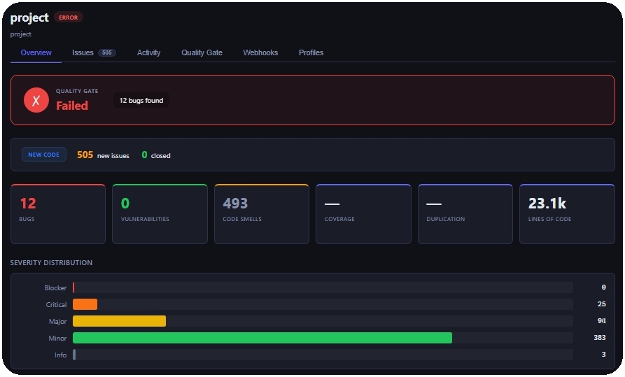
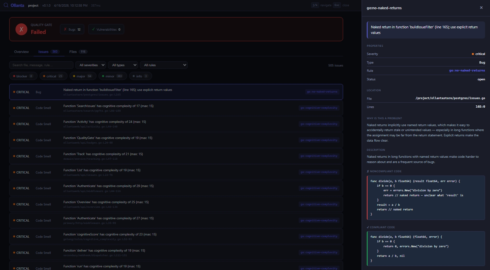

# scenes.md — Roteiro de Vídeo: Ollanta em Ação

Roteiro técnico para gravação de vídeo demonstrativo do Ollanta.
Formato: screen recording de terminal + browser, com narração ou legendas.
Duração estimada: 6–8 minutos.
Resolução sugerida: 1920×1080, tema escuro no terminal e no browser.

---

## Cena 1 — Abertura (15s)

**Visual:** Um terminal em html animado simulando um console terminal de laptop executando o ollanta scanner. O texto aparece com um efeito de digitação.

```
ollanta -project-dir . -project-key ollanta -format all -serve
```

**Legenda:**
> "Vamos rodar o Ollanta Scanner pela primeira vez. Com o flag `-serve`, o scanner analisa o código e abre automaticamente um dashboard local no browser — sem precisar configurar nada."

---

## Cena 2 — Apresentar o projeto-alvo (30s)

**Visual:** O browser abre automaticamente em `http://localhost:7777` com o dashboard do projeto "ollanta" carregado — direto após o scan terminar:



**Legenda:**
> "Este é o dashboard do projeto 'ollanta' com os resultados da análise. Aqui mostra que falhou no Quality Gate. Mostra também um overview geral, as principais issues, métricas. O desenvolvedor pode rodar na máquina e conferir localmente sem precisar esperar por uma operação de CI/CD em pipeline para depois visualizar os resultados."

---

## Cena 3 — Explorar as issues (1m)

**Visual:** Clique na seção de Issues para mostrar a lista de issues detectadas, ordenadas por severidade. Mostre uma issue específica (ex: "Large Function") e clique para abrir o detalhe da issue:



**Legenda:**
> "Aqui estão as issues detectadas, ordenadas por severidade. Vamos clicar em uma issue específica para ver o detalhe. O Ollanta mostra a mensagem da issue, a localização exata no código, a regra que gerou a issue, e até um trecho do código com destaque para a linha problemática. Isso ajuda o desenvolvedor a entender rapidamente o que está errado e onde."


---

## Cena 4 — Subindo o servidor centralizado

**Visual:** De volta ao terminal. Mostrar o comando para subir o stack completo com Docker Compose:

```
docker compose --profile server up -d
```

Output esperado:

```
[+] Running 3/3
 ✔ Container ollanta-postgres-1    Healthy
 ✔ Container ollanta-zincsearch-1  Started
 ✔ Container ollanta-ollantaweb-1  Started
```

**Legenda:**
> "Para ter histórico centralizado e acompanhar múltiplos projetos, o Ollanta tem um servidor. Três containers sobem com um único comando: PostgreSQL para persistência, ZincSearch para busca, e o ollantaweb que expõe a API REST na porta 8080."

---

## Cena 5 — Enviar resultados ao servidor (push) (45s)

**Visual:** De volta ao terminal. Rodar o scanner novamente, desta vez com os flags `-server` e `-server-token` para enviar os resultados ao servidor:

```
ollanta -project-dir . -project-key ollanta -server http://localhost:8080 -server-token ollanta-dev-scanner-token
```

Output no terminal ao final:

```
Server: gate=OK new=12 closed=0
```

**Legenda:**
> "Com um único flag a mais — `-server` — o scanner envia o relatório direto ao servidor após o scan. O servidor processa, compara com scans anteriores, avalia o quality gate e retorna o resultado. Aqui vemos: gate OK, 12 issues novas, 0 fechadas — é o primeiro envio deste projeto."

---

## Cena 6 — Histórico e tracking no servidor (45s)

**Visual:** No browser, navegue até o servidor em `http://localhost:8080`. Mostre a lista de projetos, depois entre no projeto "ollanta" e mostre o histórico de scans e a evolução das métricas ao longo do tempo:


**Legenda:**
> "No servidor, cada scan fica registrado. Dá pra ver a evolução do projeto ao longo do tempo — quantos bugs foram introduzidos, quantos foram corrigidos. O Ollanta rastreia cada issue por um hash do conteúdo da linha: se a issue foi corrigida, ela é fechada automaticamente no próximo scan. Se foi movida de arquivo, é reconhecida como a mesma issue — não abre duplicata."

---

## Cena 7 — Encerramento (15s)

**Visual:** Tela com o logo do Ollanta e os pontos principais em texto.

```
◆ Ollanta

Scan local em millisegundos
Dashboard interativo na porta 7777
Servidor centralizado com histórico
Tracking automático de issues entre scans
Quality Gates configuráveis
Relatórios JSON + SARIF para CI/CD

github.com/scovl/ollanta
```

**Legenda:**
> "Ollanta — do scan ao dashboard, em menos de um segundo."